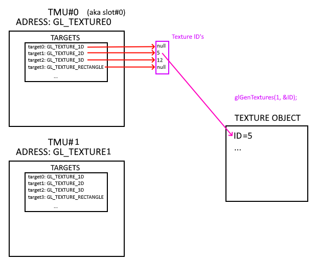

## Слоты

### Проблема

Известно, что OpenGL - state machine. 
Представим, что нам нужно использовать несколько текстур в одном фрагментном шейдере. 
Если у OpenGL будет один стейт текстуры, то при, например, наложении текстур придется перебиндить текстуру несколько раз. Вместо этого хотелось бы иметь доступ к нескольим текстурам сразу. Для этого были созданы слоты (texture units)

### Решение

*awdawda*

```cpp
text block
```


