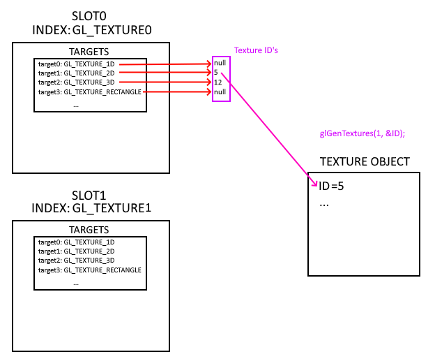
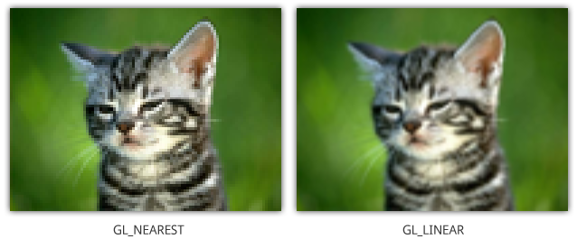
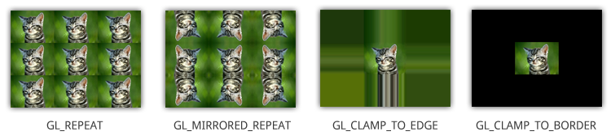
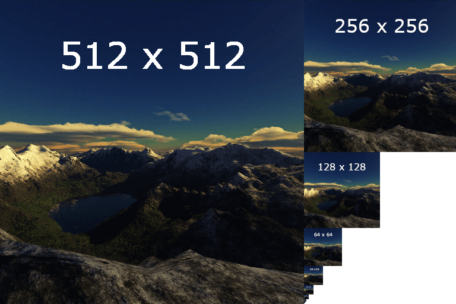

## Слоты

### Проблема

Известно, что OpenGL - state machine. 
Представим, что нам нужно использовать несколько текстур в одном фрагментном шейдере. 
Если у OpenGL будет один стейт текстуры, то при, например, наложении текстур придется перебиндить текстуру несколько раз. Вместо этого хотелось бы иметь доступ к нескольим текстурам сразу. 

Для этой цели были придуманы слоты, или Texture units

### Texture units (slots)

В сущности представляют собой часть OpenGL контекста

Можно представить как структуры, которые содержат в себе таргеты - типы текстур, на которые можно забиндить одну текстуру
Примерная схема:



### Код

Работа начинается с создания объекта текстуры

```cpp
glGenTextures(1, &ID);
```

```cpp
glActiveTexture(slot); // биндим активный слот
glBindTexture(texType, ID); // работаем внутри слота, по 
//нужному типу биндим ID текстуры
```

Все дальнейшие операции производятся с объектом текстуры, который достигается по цепочке из текущего стейта
TEXTURE UNIT -> TEXTURE TARGET -> ID -> TEXTURE OBJECT

```cpp
    glTexParameteri(texType, GL_TEXTURE_MIN_FILTER, GL_NEAREST_MIPMAP_LINEAR);
    glTexParameteri(texType, GL_TEXTURE_MAG_FILTER, GL_NEAREST);

    glTexParameteri(texType, GL_TEXTURE_WRAP_S, GL_REPEAT);
    glTexParameteri(texType, GL_TEXTURE_WRAP_T, GL_REPEAT);

    glTexImage2D(texType, 0, format, widthImg, heightImg, 0, format, pixelType, bytes);

    glGenerateMipmap(texType);
```

Разберем подробно настройку текстуры

```cpp
    glTexParameteri(texType, GL_TEXTURE_MIN_FILTER, GL_NEAREST_MIPMAP_LINEAR);
    glTexParameteri(texType, GL_TEXTURE_MAG_FILTER, GL_NEAREST);
```

Фильтры при уменьшении и увеличении текстуры.

Таблицу типов приводить лень, читай здесь: [OpenGL - Textures](https://open.gl/textures)
Вот 2 варианта для примера



Дальше

```cpp
glTexParameteri(texType, GL_TEXTURE_WRAP_S, GL_REPEAT);
glTexParameteri(texType, GL_TEXTURE_WRAP_T, GL_REPEAT);
```

То есть это описание поведения, когда текстурные координаты выходят за пределы [0,1]



```cpp
glTexImage2D(texType, 0, format, widthImg, heightImg, 0, format, pixelType, bytes);
```

Загружает данные текстуры передаются в видеопамять, связанную с объектом текстуры

Далее генерим мипмапы

```cpp
glGenerateMipmap(texType);
```

Для mipmap создается $floor(log2(max(width, height))) + 1$ изображений

Напомним, что **Mipmap** — это цепочка уменьшенных копий текстуры для оптимизации в зависимости от дистанции рендера



### Использование текстуры

```cpp
    Texture texWater("bricks16x.png", GL_TEXTURE_2D, GL_TEXTURE0, GL_UNSIGNED_BYTE);
    texWater.texUnit(shaderProgram, "tex0", 0);
```

Метод texUnit осуществляет передачу текстуры в unit как uniform

```cpp
void Texture::texUnit(Shader& shader, const char* uniform, GLuint unit)
{
	GLuint texUni = glGetUniformLocation(shader.ID, uniform);
	shader.activate();
	glUniform1i(texUni, unit);
}
```

Обратим внимание, что 

```cpp
shader.activate()
```

Здесь необходим, поскольку в сущности метод `activate()` это обертка state-changing функции `glUseProgram(ID)`, которая ставит программу №`ID` как текущую.

### Ограничения

Спецификация явно запрещает использование двух разных типов семплеров из одного текстурного блока. Предполагаемый результат : undefined behaviour
Пример:

```cpp
uniform sampler2D tex0;
uniform sampler3D tex1;

... // где то после shaderProgram.activate() по несчастливой случайности:
glUniform1i(texUni0, unit);
glUniform1i(texUni1, unit);
```
