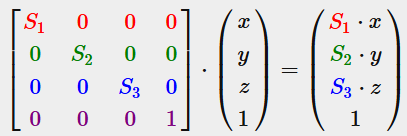
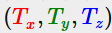
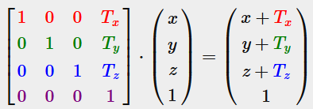

бОльшая часть материала взята с https://learnopengl.com/Getting-started/Transformations

### Масштабирование

Считаем, что понятия матрицы, вектора, простейшие операции с этими структурами уже известны

Масштабирование в сущности простая операция, которая в трехмерном пространстве описывается через матрицы следующим образом

Обратим внимание, что 4 координата в ДАННОМ случае не используется прямо, хотя далее она окажет нам большую услугу

### Перенос (Translation)

Обозначим вектор переноса как  и определим матрицу переноса

Становится очевидным удобство 4 компоненты. Приведу цитату из ранее указанного источника

**Homogeneous coordinates**  
The `w` component of a vector is also known as a homogeneous coordinate. To get the 3D vector from a homogeneous vector we divide the `x`, `y` and `z` coordinate by its `w` coordinate. We usually do not notice this since the `w` component is `1.0` most of the time. Using homogeneous coordinates has several advantages: it allows us to do matrix translations on 3D vectors (without a `w` component we can't translate vectors) ...

Also, whenever the homogeneous coordinate is equal to `0`, the vector is specifically known as a direction vector since a vector with a `w` coordinate of `0` cannot be translated.

