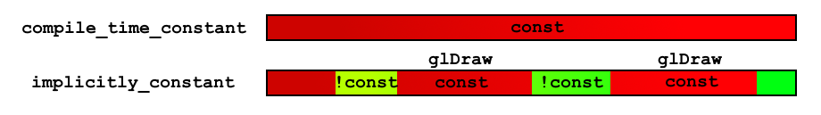

# Shaders

## Shader Invocation

## Uniforms

Квалификатор `uniform` создает `uniform` переменную. Это один из способов передачи данных в шейдер.

### Особенности default uniform переменных

#### Константны в рамках одного вызова отрисовки

> This means that the value does not change between multiple executions of a shader during the rendering of a primitive (ie: during a glDraw* call).

Действительно, странно, если при параллельной отрисовке нескольких вершин одной модели вдруг окажется, что были использованы, например, разные матрицы model

#### Неявно константны

> Uniforms are implicitly constant, within the shader (though they are not [Constant Expressions](https://wikis.khronos.org/opengl/Constant_Expression "Constant Expression")). Attempting to change them with shader code will result in a compiler error. Similarly, you cannot pass a uniform as an out or inout [parameter to a function](https://wikis.khronos.org/opengl/Function_Parameter "Function Parameter").

### Работа с uniforms

После линковки шейдерной программы `glLinkProgram(ID);` неиспользуемые uniform переменные игнорируются. Оставшиеся получают уникальный идентификатор, который может быть получен через `glGetUniformLocation(shader.ID, uniform)`. В объекте программы шейдера аллоцируется память под uniform переменные.

### Источники

[Core Language (GLSL) - OpenGL Wiki](https://wikis.khronos.org/opengl/Core_Language_(GLSL))
